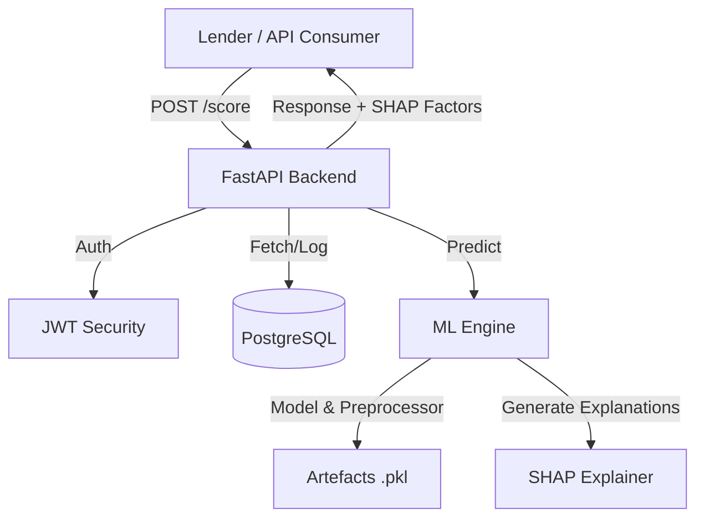
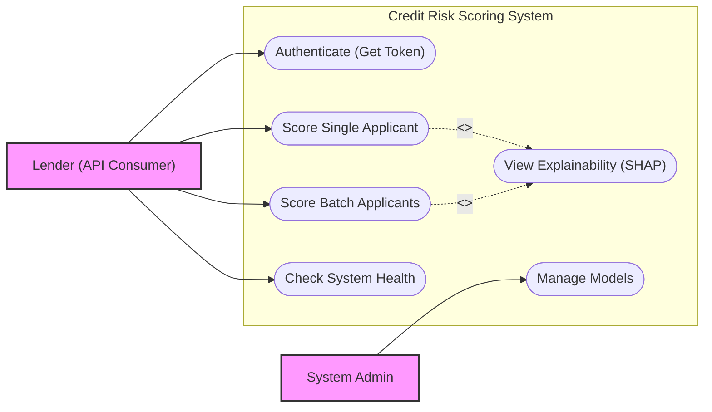
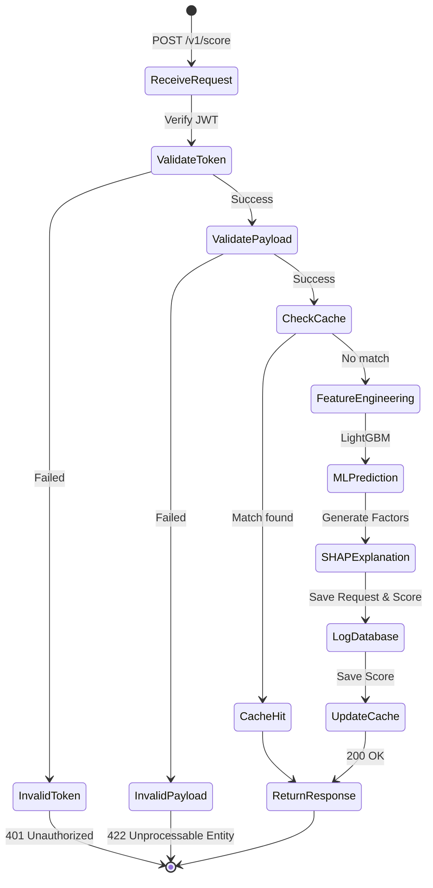
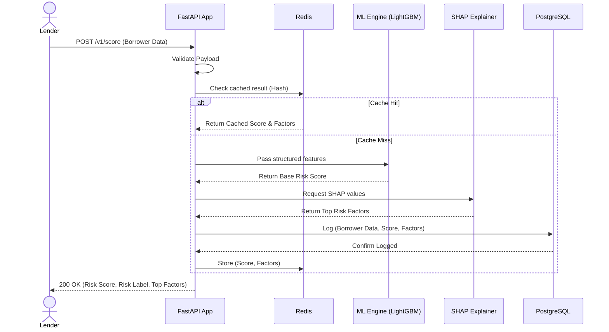
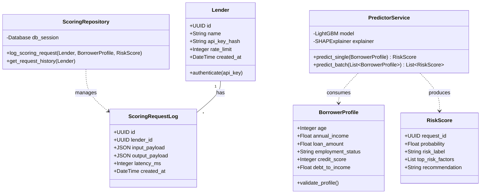
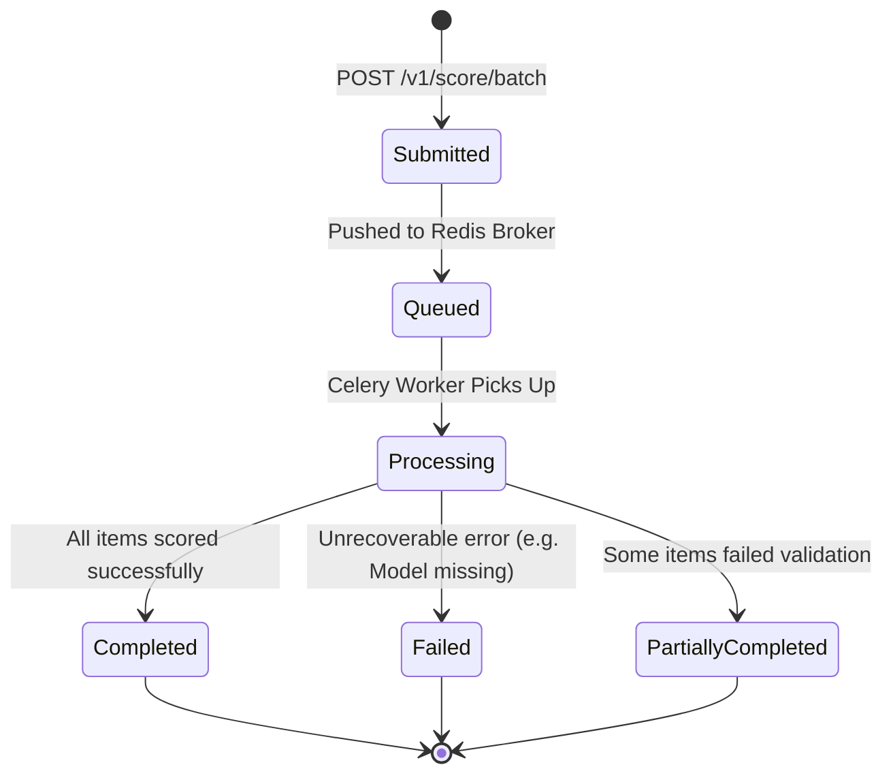

# 🧠 Credit Risk Scoring System

### Final Year Computer Science Project
**University of Benin | Department of Computer Science**

---

## 📋 Project Overview

The **Credit Risk Scoring System** is a production-grade machine-learning-powered REST API designed to predict the probability of loan default. Targeted at the rapidly growing Nigerian digital lending market, this system provides fintech lenders (like Carbon, FairMoney, and Renmoney) with a robust, automated, and explainable tool for credit underwriting.

This project goes beyond simple prediction by integrating **SHAP (SHapley Additive exPlanations)** to provide transparent, human-readable reasons for every credit decision, ensuring regulatory compliance and borrower trust.

## 🚀 Key Features

- **High-Performance ML Model:** Built using LightGBM, optimized for tabular financial data with an AUC-ROC target of ≥ 0.85.
- **Real-time Explainability:** Every API response includes the top risk factors powered by SHAP.
- **Production-Ready API:** Developed with FastAPI, featuring async support, JWT authentication, and automated Swagger documentation.
- **Robust Data Handling:** Engineered to handle "thin-file" borrowers using alternative credit signals common in the Nigerian context.
- **Containerized Deployment:** Full stack orchestration using Docker and Docker Compose, ready for AWS deployment.

## 🏗️ System Architecture


*(Note: Diagram rendered via Mermaid. If not visible, see `docs/architecture.png`)*


## 📐 System UML Diagrams

The following diagrams illustrate the architecture, behaviour, and structure of the final proposed system.

### 1. Use Case Diagram
Describes the interactions between the primary actor (the Lender) and the core capabilities of the system.



### 2. Activity Diagram
Details the step-by-step workflow of a single scoring request.



### 3. Sequence Diagram
Illustrates the exact sequence of messages passed between system components during a single scoring API call.



### 4. Class Diagram
Outlines the primary domain models and core service classes that drive the application logic.



### 5. State Diagram
Tracks the lifecycle states of an asynchronous batch scoring job handled by Celery.



## 🛠️ Tech Stack

- **Language:** Python 3.10+
- **Machine Learning:** LightGBM, Scikit-learn, Pandas, SMOTE (imbalanced-learn)
- **Explainability:** SHAP
- **API Framework:** FastAPI (Pydantic for validation)
- **Database:** PostgreSQL (SQLAlchemy ORM + Alembic Migrations)
- **Caching/Task Queue:** Redis & Celery (for batch scoring)
- **Infrastructure:** Docker, Docker Compose, AWS (EC2, S3, RDS)

## 📂 Project Structure

Following a feature-based Object-Oriented design:

```text
.
├── app/                  # FastAPI Application
│   ├── core/             # Auth, Config, Global Exceptions
│   ├── credit_scoring/   # Scoring Feature (Routes, Schemas, Services)
│   ├── models/           # SQLAlchemy DB Models
│   └── main.py           # App Entry Point
├── ml/                   # Machine Learning Layer
│   ├── notebooks/        # EDA and Training Experiments
│   ├── src/              # Production ML Classes (Trainer, Explainer)
│   └── artefacts/        # Serialized Model Files (.pkl)
├── data/                 # Raw and Processed Datasets (Gitignored)
├── tests/                # Unit and Integration Tests
├── Dockerfile            # Container Definition
└── docker-compose.yml    # Multi-container Orchestration
```

## ⚙️ Installation & Local Setup

### Prerequisites
- Python 3.10+
- Docker & Docker Compose

### Step 1: Clone the Repository
```bash
git clone https://github.com/your-username/credit-risk-api.git
cd credit-risk-api
```

### Step 2: Set up Environment
```bash
python -m venv venv
source venv/bin/activate  # On Windows: venv\Scripts\activate
pip install -r requirements.txt
cp .env.example .env
```

### Step 3: Spin up Services
```bash
docker-compose up -d
```

### Step 4: Run the API
```bash
uvicorn app.main:app --reload
```
The API will be available at `http://localhost:8000`. Access the interactive documentation at `http://localhost:8000/docs`.

## 📊 API Documentation

The system exposes several key endpoints:
- `POST /v1/score`: Single applicant credit scoring with SHAP explanations.
- `POST /v1/score/batch`: Asynchronous batch scoring for multiple applicants.
- `GET /v1/health`: System health and model versioning info.
- `POST /v1/auth/token`: Authentication for lenders.

## 📈 Roadmap (Development Phases)

- [x] **Phase 0:** Environment Setup & Architecture Design
- [ ] **Phase 1:** Data Engineering & Exploratory Data Analysis (EDA)
- [ ] **Phase 2:** Model Development & SHAP Integration
- [ ] **Phase 3:** Backend API Development & Security
- [ ] **Phase 4:** Cloud Deployment (AWS)
- [ ] **Phase 5:** Final Documentation & Thesis Submission

---

## 🎓 Academic Context

- **Institution:** University of Benin (UNIBEN)
- **Faculty:** Physical Sciences
- **Department:** Computer Science
- **Level:** 400 Level (Final Year)
- **Developer:** [Your Name]
- **Supervisor:** [Supervisor's Name]

---

## 📄 License
This project is for academic purposes as part of a final year requirement.
