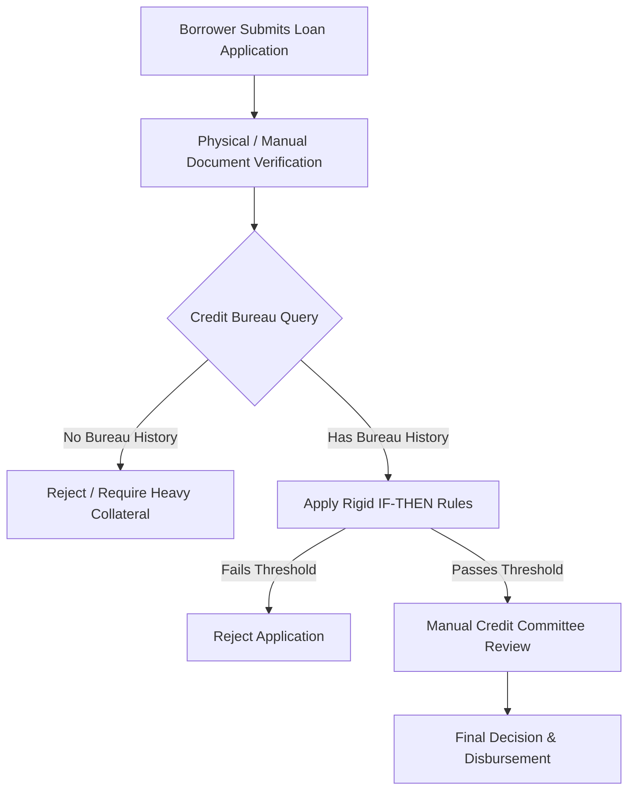
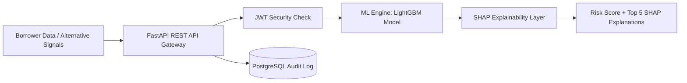
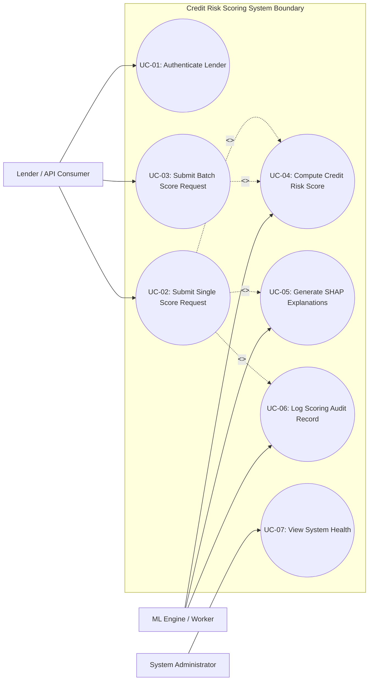
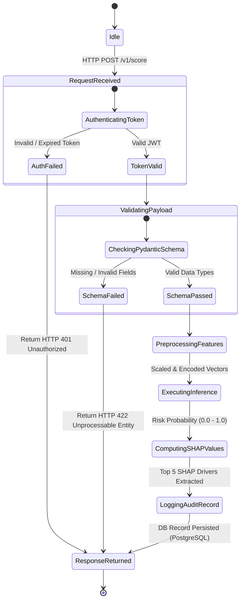
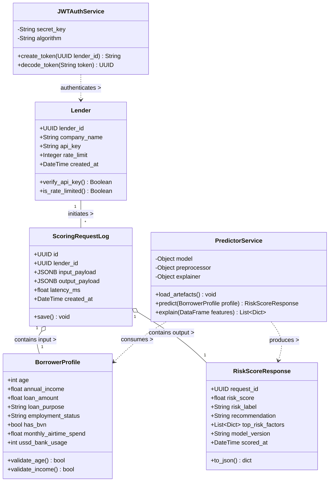

# CHAPTER 3: SYSTEM ANALYSIS AND DESIGN

---

## 3.1 System Analysis

System analysis is the fundamental phase in the software engineering lifecycle where a deep understanding of the problem domain, business requirements, and operational workflows is established before constructing a software solution. In the context of credit underwriting and financial technology (Fintech), system analysis involves examining how creditworthiness is currently assessed by financial institutions, evaluating technological and structural bottlenecks, and specifying the architectural requirements for an automated, machine-learning-driven solution.

The primary objective of this system analysis is to bridge the gap between traditional credit assessment frameworks and modern computational intelligence. The analysis focuses specifically on the **Nigerian Digital Lending Market**, an ecosystem characterized by rapid growth, high demand for micro-loans, and a significant proportion of "thin-file" borrowers—individuals who lack formal credit histories with centralized credit bureaus (such as CRC Credit Bureau or FirstCentral Credit Bureau). 

To ensure a rigorous technical foundation, this project adopts an **Object-Oriented Analysis and Design (OOAD)** methodology. The analysis covers both functional requirements (e.g., real-time risk scoring, explainable predictions, asynchronous batch processing) and non-functional requirements (e.g., sub-500ms latency, high availability, security via JSON Web Tokens, and regulatory compliance with Central Bank of Nigeria guidelines).

---

## 3.2 Analysis of Existing System

The existing credit underwriting ecosystem in traditional Nigerian commercial banks and early-generation digital lending applications relies heavily on legacy assessment models. These models can be categorized into two main paradigms: **Manual Underwriting** and **Static Rule-Based Scoring Engines**.



### 3.2.1 Workflow of the Existing System
1. **Application Submission:** The applicant submits physical or digital forms containing basic demographic information, bank account details, and requested loan parameters.
2. **Document Verification:** Manual verification of physical documents (e.g., utility bills, paper bank statements, employer confirmation letters, physical IDs).
3. **Credit Bureau Inquiry:** The lender queries centralized credit registries (CRC, FirstCentral) for historical loan performance.
4. **Rule Evaluation:** A static rule engine applies hard-coded conditional logic (e.g., `IF Annual_Income < ₦1,000,000 THEN Reject`, `IF Credit_Score < 650 THEN Reject`).
5. **Subjective Approval:** For marginal cases, applications are passed to human loan officers or credit committees for subjective evaluation.

---

## 3.3 Problem of Existing System

Through systemic analysis, several critical operational, technological, and economic flaws were identified in the existing underwriting workflow:

1. **Financial Exclusion of "Thin-File" Borrowers:** Traditional models rely strictly on historical credit bureau records. In Nigeria, millions of creditworthy individuals (informal sector workers, recent graduates, micro-entrepreneurs) have no credit bureau footprint. The existing system automatically declines these applicants, creating severe financial exclusion.
2. **Slow Processing Turnaround Time:** Manual document inspection and credit committee reviews prolong the decisioning process from several hours to weeks, failing to meet the market demand for instant digital micro-loans.
3. **High Default Rates due to Limited Signals:** Static rule engines fail to capture non-linear relationships and subtle behavioral patterns. They ignore critical alternative credit signals such as mobile airtime spend, USSD banking session frequency, utility payment consistency, and digital wallet transactions.
4. **Opaque "Black-Box" Decisions:** Existing automated scoring systems return binary outcomes (Approved/Rejected) without providing granular explanations to borrowers or auditors. Borrowers receive no actionable feedback on how to improve their creditworthiness, violating modern consumer protection standards.
5. **Human Subjectivity and Bias:** Manual underwriting introduces inconsistency, human error, and potential personal bias into loan decisions, leading to unstandardized risk exposure across branch offices.
6. **Inability to Scale:** Manual workflows scale linearly with headcount. Lenders cannot handle exponential increases in loan application volumes during peak economic periods without incurring unsustainable operational costs.

---

## 3.4 Overview of Proposed System

The proposed **Credit Risk Scoring System** is an enterprise-grade, machine-learning-powered REST API microservice designed to provide real-time, explainable credit underwriting for digital lenders operating in developing financial markets.



### 3.4.1 Key Capabilities of the Proposed System
- **Machine Learning Core:** Leverages optimized gradient boosting algorithms (**LightGBM**, XGBoost, Random Forest) trained on contextual loan datasets to capture non-linear interactions and accurately predict default probability ($0.0 - 1.0$).
- **Alternative Data Signal Integration:** Specifically engineered for thin-file applicants by utilizing non-traditional parameters such as Bank Verification Number (BVN) validation, mobile airtime expenditure, USSD session frequency, telco provider profiles, and betting account indicators.
- **Explainable AI (XAI) via SHAP:** Integrated with **SHAP (SHapley Additive exPlanations)** `TreeExplainer`. Every scoring response contains the top 5 positive and negative risk drivers, transforming black-box model predictions into transparent, audited, plain-English explanations.
- **Microservices REST API:** Built with **FastAPI**, featuring asynchronous request handling, automatic OpenAPI/Swagger interactive documentation, and Pydantic data validation.
- **Asynchronous Batch Processing:** Integrates **Redis** and **Celery** to process large-scale bulk scoring requests asynchronously without blocking core API threads.
- **Enterprise Security and Auditability:** Implements JSON Web Token (JWT) authentication for lender API access and persists every request/response payload into a **PostgreSQL** database for regulatory compliance and audit trails.

---

## 3.5 Proposed System Architecture and Interface

The system follows a modular, 5-tier microservice architecture to ensure scalability, maintainability, and high performance.

### 3.5.1 Multi-Tier Architecture Description

1. **Client / Consumer Layer:** Third-party fintech lender applications (e.g., Carbon, FairMoney, Renmoney), mobile backends, and an internal administrative Streamlit dashboard.
2. **API & Security Layer (FastAPI Gateway):** Manages routing, rate-limiting (60 req/min), CORS policy, Pydantic request body validation, and JWT security verification.
3. **Machine Learning & Explainability Layer:** Contains the pre-trained serialized model artifacts (`model.pkl`, `preprocessor.pkl`) and the SHAP `TreeExplainer` instance. Executes model inference and calculates feature contribution values.
4. **Persistence & Messaging Layer:** 
   - **PostgreSQL Database:** Persists lender account credentials and immutable audit logs (`ScoringRequestLog`).
   - **Redis & Celery:** Handles asynchronous message queuing for background batch scoring tasks.
5. **Infrastructure & Cloud Layer:** Containerized using **Docker** and **Docker Compose**, ready for AWS deployment (EC2 compute instance, RDS PostgreSQL instance, S3 artifact store, CloudWatch monitoring).

### 3.5.2 System Architecture Diagram

```mermaid
graph TD
    subgraph Client Layer
        A1[Fintech Web Application]
        A2[Mobile App Backend]
        A3[Streamlit Admin Dashboard]
    end

    subgraph REST API & Security Layer (FastAPI)
        B1[API Router / Endpoints]
        B2[JWT Security Manager]
        B3[Pydantic Validation Engine]
    end

    subgraph Machine Learning & Explainability Engine
        C1[Preprocessing Pipeline .pkl]
        C2[LightGBM Model Engine .pkl]
        C3[SHAP TreeExplainer]
    end

    subgraph Persistence & Task Queue Layer
        D1[(PostgreSQL Database)]
        D2[(Redis Message Broker)]
        D3[Celery Batch Worker Pool]
    end

    A1 -->|HTTP POST /v1/score| B1
    A2 -->|HTTP POST /v1/score| B1
    A3 -->|HTTP GET / POST| B1
    B1 --> B2
    B2 -->|Authenticated| B3
    B3 -->|Validated Payload| C1
    C1 --> C2
    C2 --> C3
    C3 -->|Risk Score + SHAP Factors| B1
    B1 -->|Audit Record| D1
    B1 -->|Batch Task| D2
    D2 --> D3
```

### 3.5.3 User and API Interface Design

The proposed system exposes two primary interfaces: an interactive **OpenAPI/Swagger UI** interface for developer integration and a **RESTful JSON API** contract.

#### 1. API Endpoints Specification

| Method | Endpoint | Description | Auth Required |
| :--- | :--- | :--- | :--- |
| `POST` | `/v1/auth/token` | Authenticate lender credentials and issue JWT bearer token | No |
| `POST` | `/v1/score` | Execute real-time single applicant scoring with SHAP explanations | Yes (JWT) |
| `POST` | `/v1/score/batch` | Queue an asynchronous batch scoring task for multiple applicants | Yes (JWT) |
| `GET` | `/v1/health` | System health check, model version, and uptime metrics | No |

#### 2. Sample Request Payload (`POST /v1/score`)
```json
{
  "age": 32,
  "annual_income": 3500000.0,
  "loan_amount": 450000.0,
  "loan_purpose": "business",
  "employment_status": "Self-employed",
  "has_bvn": true,
  "telco_provider": "MTN",
  "monthly_airtime_spend": 15000.0,
  "active_betting_account": false,
  "ussd_bank_usage": 24,
  "is_repeat_customer": true,
  "loan_term_months": 12
}
```

#### 3. Sample Response Payload (`200 OK`)
```json
{
  "request_id": "9b1deb4d-3b7d-4bad-9bdd-2b0d7b3dcb6d",
  "risk_score": 0.142,
  "risk_label": "LOW",
  "recommendation": "APPROVED: Applicant exhibits strong repayment signals.",
  "top_risk_factors": [
    {
      "feature": "monthly_airtime_spend",
      "impact": -0.185,
      "direction": "Decreases Default Risk",
      "description": "High airtime spend indicates steady disposable cash flow."
    },
    {
      "feature": "has_bvn",
      "impact": -0.120,
      "direction": "Decreases Default Risk",
      "description": "Verified identity via Bank Verification Number."
    },
    {
      "feature": "loan_amount",
      "impact": 0.045,
      "direction": "Increases Default Risk",
      "description": "Higher loan principal slightly increases debt burden."
    }
  ],
  "model_version": "v1.2.0-lightgbm",
  "scored_at": "2026-07-29T01:30:00Z"
}
```

---

## 3.6 System Design

System design transitions the functional requirements defined in system analysis into operational software components. This project adheres to core software architecture principles:

1. **Modular Decomposition:** System components are segregated into independent, cohesive Python modules (`core`, `credit_scoring`, `models`, `ml/src`).
2. **Separation of Concerns (SoC):** Database models (`SQLAlchemy`), request schemas (`Pydantic`), business logic services (`ScoringService`), and ML inference code (`PredictorService`) operate independently.
3. **Object-Oriented Design (OOD):** All core routines are defined using encapsulation, inheritance, and polymorphism to maximize reusability and simplify unit testing.

---

## 3.7 System Design Tools

The development of the proposed system leverages industry-standard modeling, backend, and machine learning tools:

- **Modeling & Diagrams:** Mermaid.js and Unified Modeling Language (UML) for architectural and behavioral visualization.
- **Backend Web Framework:** **FastAPI** (Python 3.10+) for async web routing and auto-generated API specifications.
- **Data Validation & ORM:** **Pydantic** for data type enforcement and **SQLAlchemy** with **Alembic** for object-relational mapping and database migrations.
- **Machine Learning & Math:** **LightGBM**, **Scikit-learn**, **Pandas**, and **NumPy** for data pre-processing, model training, hyperparameter optimization, and inference.
- **Explainable AI:** **SHAP (SHapley Additive exPlanations)** for game-theoretic feature attribution.
- **Containerization & Orchestration:** **Docker** and **Docker Compose** for reproducible deployment environments.

---

## 3.8 System Design Tool: UML

The **Unified Modeling Language (UML)** is a standardized modeling language consisting of an integrated set of diagrams, developed to help system and software developers specify, visualize, construct, and document the artifacts of software systems.

In Object-Oriented Analysis and Design (OOAD), UML serves as the primary blueprinting language. This project utilizes three key UML diagrams:
1. **Use Case Diagram (Behavioral):** Models system functionality and actor interactions.
2. **State Machine Diagram (Behavioral):** Captures the lifecycle states and transitions of a scoring request.
3. **Class Diagram (Structural):** Maps object-oriented structure, class attributes, methods, and relationships.

---

## 3.9 UML – Use Case Diagram

The Use Case Diagram depicts the interactions between external actors and the internal functions (use cases) of the system.

### 3.9.1 Primary Actors
- **Lender / API Consumer:** Third-party fintech system or credit analyst invoking the API endpoints.
- **System Administrator:** Internal administrator overseeing system health and API access credentials.
- **ML Scoring Engine:** Secondary automated actor executing inference and generating SHAP values.

### 3.9.2 Detailed Use Case Descriptions

| Use Case ID | Use Case Name | Primary Actor | Description | Preconditions | Postconditions |
| :--- | :--- | :--- | :--- | :--- | :--- |
| **UC-01** | Authenticate Lender | Lender | Submits client credentials to obtain a JWT bearer token. | Lender account exists. | Valid JWT token issued. |
| **UC-02** | Submit Single Score | Lender | Sends single applicant payload for credit risk evaluation. | Valid JWT token presented. | Risk score & SHAP returned. |
| **UC-03** | Submit Batch Score | Lender | Submits bulk array of borrower profiles for async scoring. | Valid JWT token presented. | Batch Job ID returned. |
| **UC-04** | Compute Risk Score | ML Engine | Processes pre-processed features through LightGBM. | Valid payload received. | Probability score calculated. |
| **UC-05** | Generate SHAP Factors| ML Engine | Calculates feature attributions using TreeExplainer. | Model prediction complete. | Top 5 factors extracted. |
| **UC-06** | Log Scoring Audit | ML Engine | Persists request/response JSON payloads to PostgreSQL. | Scoring request complete. | Record saved in DB. |
| **UC-07** | View System Health | System Admin | Checks API status, database status, and model metadata. | None. | Health status returned. |

### 3.9.3 Use Case Diagram



---

## 3.10 UML – State Machine Diagram

The State Machine Diagram describes the behavioral lifecycle of a single scoring request as it transitions through various internal processing states.

### 3.10.1 State Transitions
1. **Idle:** System awaits incoming HTTP request.
2. **Request Received:** HTTP POST payload hits FastAPI router `/v1/score`.
3. **Authenticating Token:** JWT token decoded and validated. If invalid $\rightarrow$ Transition to **Authentication Failed**.
4. **Validating Payload:** Pydantic checks schema types and bounds. If invalid $\rightarrow$ Transition to **Validation Error**.
5. **Preprocessing Features:** Preprocessor pipeline transforms raw fields (encoding categoricals, scaling numeric inputs).
6. **Executing Inference:** LightGBM model calculates credit default probability.
7. **Computing SHAP Values:** SHAP `TreeExplainer` calculates marginal feature impacts.
8. **Logging Audit Record:** Request payload, output score, and latency persisted to PostgreSQL.
9. **Returning Response:** HTTP `200 OK` JSON response delivered to client.

### 3.10.2 State Machine Diagram



---

## 3.11 UML – Class Diagram

The Class Diagram presents the static structural model of the system, illustrating software classes, attributes, operations (methods), visibility, and structural relationships.

### 3.11.1 Class Definitions and Attributes

1. **`Lender` (DB Entity):** Represents an API consumer.
   - Attributes: `+lender_id: UUID`, `+company_name: String`, `+api_key: String`, `+rate_limit: Integer`, `+created_at: DateTime`
   - Methods: `+verify_api_key(): Boolean`, `+is_rate_limited(): Boolean`
2. **`BorrowerProfile` (Pydantic Schema):** Represents raw input applicant payload.
   - Attributes: `+age: int`, `+annual_income: float`, `+loan_amount: float`, `+loan_purpose: str`, `+employment_status: str`, `+has_bvn: bool`, `+monthly_airtime_spend: float`, `+ussd_bank_usage: int`
   - Methods: `+validate_age(): bool`, `+validate_income(): bool`
3. **`RiskScoreResponse` (Pydantic Schema):** Represents API response payload.
   - Attributes: `+request_id: UUID`, `+risk_score: float`, `+risk_label: str`, `+recommendation: str`, `+top_risk_factors: List[Dict]`, `+model_version: str`, `+scored_at: DateTime`
   - Methods: `+to_json(): dict`
4. **`ScoringRequestLog` (DB Entity):** Persisted audit entity in PostgreSQL.
   - Attributes: `+id: UUID`, `+lender_id: UUID`, `+input_payload: JSONB`, `+output_payload: JSONB`, `+latency_ms: float`, `+created_at: DateTime`
   - Methods: `+save(): void`
5. **`PredictorService` (Engine Class):** Orchestrates preprocessing, LightGBM prediction, and SHAP calculation.
   - Attributes: `-model: LightGBMModel`, `-preprocessor: ColumnTransformer`, `-explainer: TreeExplainer`
   - Methods: `+load_artefacts(): void`, `+predict(profile: BorrowerProfile): RiskScoreResponse`, `+explain(features: DataFrame): List[Dict]`
6. **`JWTAuthService` (Security Class):** Manages authentication tokens.
   - Attributes: `-secret_key: str`, `-algorithm: str`
   - Methods: `+create_token(lender_id: UUID): str`, `+decode_token(token: str): UUID`

### 3.11.2 Class Diagram


